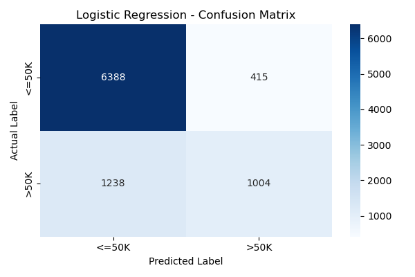
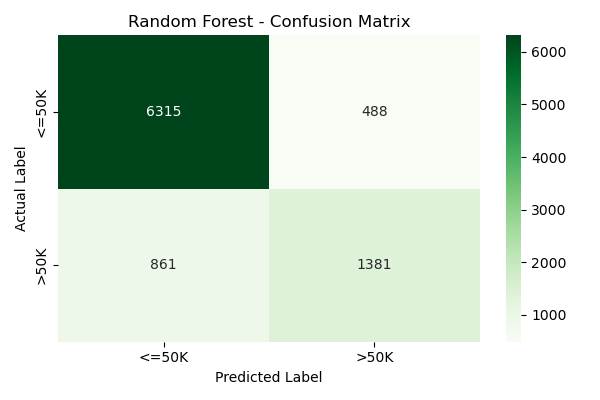

#  Adult Income Prediction using Demographic Data

An end-to-end Machine Learning pipeline built using **Python** and **Scikit-Learn** to predict whether an individual's annual income exceeds **$50K** based on census/demographic data (UCI Adult Income Dataset).

---

##  Project Overview & Workflow
This project focuses on handling class imbalance, exploratory data preprocessing, feature engineering, and evaluating multiple classification algorithms to determine the best predictive model for financial profiling and demographic risk assessment.

###  Machine Learning Pipeline:
1. **Data Exploration & Cleaning:** Detected and handled hidden missing data structures represented as `?` strings; managed whitespace formatting errors and dropped rows containing incomplete information.
2. **Feature Engineering & Categorical Encoding:** Implemented `LabelEncoder` for high-cardinality categorical attributes (e.g., occupation, education) and standard binary mapping for the target income variable (`1` for >50K, `0` for <=50K).
3. **Data Splitting & Feature Scaling:** Utilized a **Stratified Train-Test Split (80:20)** to strictly preserve minority-to-majority class ratios, followed by feature normalization using `StandardScaler` for the linear baseline.
4. **Predictive Modeling:** Trained and fine-tuned a linear baseline (**Logistic Regression**) against an ensemble structure (**Random Forest Classifier**).

---

##  Comprehensive Performance Evaluation

The dataset presents a **75:25 class imbalance** (majority earning $\le50K$). Therefore, models were heavily evaluated on **Recall (Sensitivity)** and **ROC-AUC Score** alongside global accuracy to minimize critical False Negatives.

###  Metrics Comparison Table

| Machine Learning Model | Global Accuracy | Precision (Class: >50K) | Recall / Sensitivity (Class: >50K) | F1-Score (Balanced Metric) | ROC-AUC Score |
| :--- | :---: | :---: | :---: | :---: | :---: |
|  **Logistic Regression** | 83.06% | 69.11% | 47.27% | 56.15% | 0.8642 |
|  **Random Forest Classifier** | **86.36%** | **73.45%** | **64.18%** | **68.50%** | **0.9136** |

###  Crucial Technical Insights
* **The Recall Breakthrough:** **Random Forest** is the definitive winner, showing a massive **17% jump in Recall (64.18% vs 47.27%)**. This means it drastically reduces False Negatives, making it much more capable of capturing actual high earners.
* **Why Random Forest Excelled:** Tree-based structures naturally map complex, non-linear feature interactions (such as the combined impact of *Age, Education-Num,* and *Marital Status*) seamlessly, whereas Logistic Regression's linear boundary struggles with multi-variable non-linear dynamics.
* **Class Imbalance Effect:** Due to fewer positive instances (`>50K`), both models show a higher Precision than Recall, making them slightly conservative when predicting high-income brackets.

---

##  Visualizations

### Confusion Matrices
Below are the saved evaluation matrices generated from the evaluation phase:

| Logistic Regression Matrix | Random Forest Matrix |
| :---: | :---: |
|  |  |

---

##  Executive Summary & Business Insights

* **Education is King:** Higher formal education metrics (`education-num`) show the strongest positive correlation with the high-income bracket.
* **The Age Factor:** Income distribution peaks in middle age (approx. 35–50 years), reflecting the impact of professional experience and career stability.
* **Marital Status Dynamics:** Married individuals represent a disproportionately larger share of the high-income bracket compared to single, divorced, or separated individuals.
* **Use Case:** For financial institutions, combining these demographic variables can serve as a highly accurate proxy baseline for credit-scoring models when explicit financial history is unavailable.

---

##  How to Run This Project Locally

1. **Clone the repository:**
   ```bash
   git clone [https://github.com/Miss-Imtiaz/Adult-Income-Prediction-ML.git](https://github.com/Miss-Imtiaz/Adult-Income-Prediction-ML.git)
2. **Install dependencies:**
pip install pandas numpy matplotlib seaborn scikit-learn
3. **Dataset:** Place the adult.csv dataset in the root directory.

4. **Execution:** Open and run the Jupyter Notebook in VS Code or Google Colab.
